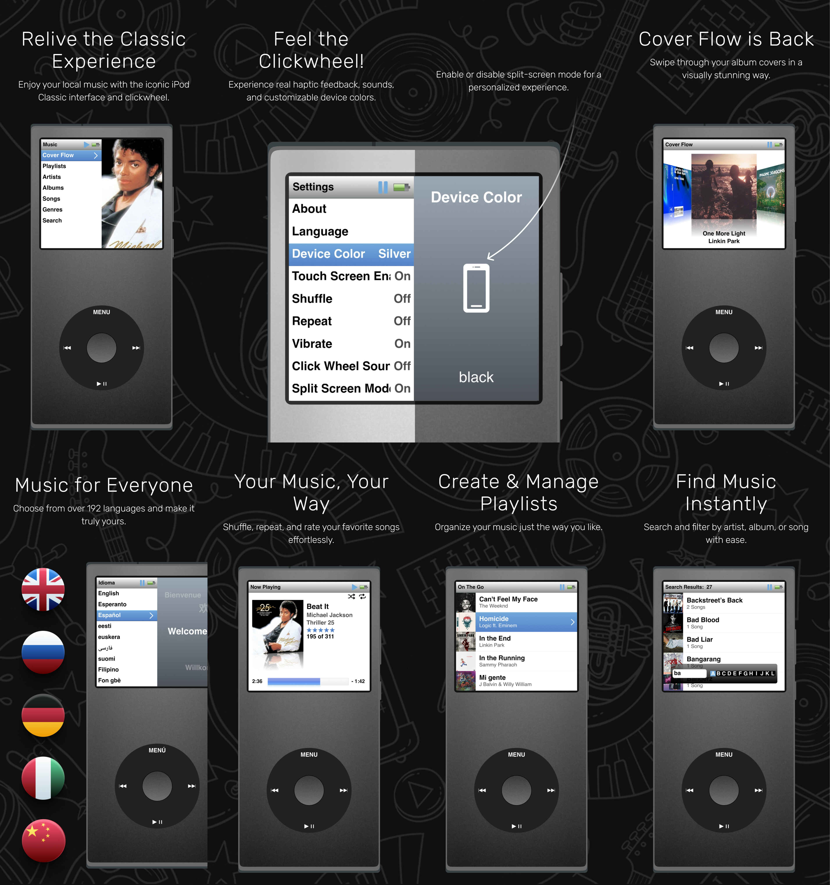

# 🎵 ClassiPod

ClassiPod brings an iPod Classic-inspired click wheel to your music collection.
Play local audio files or stream from a Subsonic-compatible server, including
Navidrome. Browse both libraries together, or focus on your server collection.

Available for Android, iOS, macOS, Windows, Linux and web. Native apps support
local music and server streaming. The web app plays demo songs or connects to
your server; it does not import local folders.

Local files play offline. Server music requires your own compatible server,
an account on that server, and a network connection. ClassiPod does not include
a music subscription, offline server downloads, or server playlist syncing.

## ✨ Features

### 🗃️ Your library, local and streamed

- 🌐 Stream from Subsonic-compatible servers such as Navidrome through
  **Settings → Library Settings → Subsonic**.
- 🏠 Combine local and server tracks, or use **Hide Local Music** while streaming.
- 🧑‍🎤 Browse songs, artists, album artists, albums, and genres.
- 🔍 Search songs, artists, albums, and your ClassiPod playlists.
- 📂 Discover Android music through MediaStore. Select a parent music folder on
  iOS, macOS, Windows, or Linux and scan its subfolders automatically.
- ⚡ Cache metadata and artwork for faster startup, refresh the library,
  rebuild the index and exclude folders.
- 📋 Inspect unreadable files and retry guidance in **Missing Tracks**.
- 🧹 Optionally hide duplicate filenames without deleting music files.
- 📃 Create and save custom ClassiPod playlists.
- ⭐ Rate songs, with ratings and edits stored in ClassiPod.
- 📝 View embedded lyrics when available.
- 🎶 Play MP3, WAV, FLAC, M4A, MP4, Ogg, Opus, AAC, AIFF, APE, and MOV audio,
  subject to the platform's playback support.

### 🎧 Playback and controls

- 🎡 Navigate with the rotating click wheel or touchscreen.
- ⏮️ Skip tracks, seek forward or backward, and adjust volume in the app.
- 🔀 Shuffle songs or whole albums, keeping album tracks in disc/track order.
- ➰ Repeat one song or the current queue.
- 💾 Restore the previous queue and selected song after reopening, paused at
  the beginning of the song.
- 💤 Set a sleep timer for 15, 30, 45, or 60 minutes, or the end of the song.
- 📱 Enjoy background playback and mobile media controls, Windows system media
  controls, and Linux MPRIS controls where supported.
- 📡 Recover server playback after temporary connection failures, with buffering
  feedback and a Retry action when needed.
- ⏩ Scrub to a previewed position before committing the seek.
- 💿 See queue position and progress in Now Playing, with access to ratings,
  shuffle controls, and available lyrics.

### 📱 The iPod Classic-inspired interface

- 🎞️ Explore Cover Flow with **Original** and **Big** layouts, smooth wheel
  motion, and animated transitions.
- 🪞 Enjoy reflective album artwork.
- 🎨 Choose light and dark screen themes and device colors including Silver,
  Black, OLED Black, and more.
- 📺 Browse with split-screen previews and scrolling titles.
- 🔤 See a letter indicator while scrolling quickly through your collection.
- 📌 Return to remembered selections and scroll positions when navigating back.
- ⏱️ Automatically return to Now Playing after inactivity during playback;
  temporary Now Playing controls also return to the progress view.
- 🔉 Hear bundled iPod-inspired click wheel sounds.
- 📳 Enable vibration feedback on supported devices.
- 🖥️ Use responsive layouts and fullscreen Immersive Mode.
- 🔋 View battery level and charging status where supported.
- 📖 Get started with the introductory tutorial.
- ℹ️ Find app information in the About screen.
- 🌍 Use ClassiPod in your language with a multilingual interface.

### 🎵 Supported audio formats

ClassiPod imports a format when its metadata can be read and at least one
configured playback backend can play it. Playback availability therefore varies
by platform:

| Format         | Extensions               | Expected playback                               |
|----------------|--------------------------|-------------------------------------------------|
| MP3            | `.mp3`                   | Android, iOS, Windows, Linux, web               |
| PCM WAV        | `.wav`                   | Android, iOS, Windows, Linux, web               |
| FLAC           | `.flac`                  | Android, iOS, Windows, Linux, major browsers    |
| AAC in MP4     | `.m4a`, `.mp4`           | Android, iOS, Windows, Linux, major browsers    |
| Ogg Vorbis     | `.ogg`                   | Android, Windows, Linux, supporting browsers    |
| Ogg Opus       | `.opus`                  | Android, Windows, Linux, supporting browsers    |
| Raw ADTS AAC   | `.aac`                   | Android, iOS, Windows, Linux; browser-dependent |
| AIFF / AIFF-C  | `.aif`, `.aiff`, `.aifc` | iOS, Windows, Linux                             |
| Monkey's Audio | `.ape`                   | Windows, Linux                                  |
| QuickTime      | `.mov`                   | iOS, Windows, Linux; browser-dependent          |

### 🔜 Upcoming Features

- 🎮 Ipod Built-in Games
- 📸 Ability to View Photos and Videos from the device

## Connect to Subsonic or Navidrome

Open **Settings → Library Settings → Subsonic** and enter the server's base
URL (including any reverse-proxy path), username and password. ClassiPod
supports token-authenticated Subsonic API 1.13+ servers, including Navidrome.
The connection is checked before saving. Native apps combine server and local music; Web shows
the server library instead of demo songs while enabled.

**Configure Subsonic** edits the connection or removes it. Turning Subsonic off
keeps its configuration and cache, hides its tracks, and stops server playback.
**Hide Local Music** shows only server music while Subsonic is enabled.
**Prevent Duplicate Tracks** hides matching filenames without deleting files.
Saved playlist entries remain available when the same server is reconnected.
**Refresh Library** fetches a new catalog; **Re-index** also clears cached
server artwork. Failed scans retain the previous catalog. Ratings and edits
stay in ClassiPod and are not written back to the server.

Native passwords use OS secure storage. Web passwords last only until reload;
re-enter the password through Configure Subsonic or when starting playback.
Metadata and artwork are cached, but audio is streamed and requires a connection.
Server playlist synchronization and offline audio downloads are not included.

Web servers must allow CORS from the ClassiPod origin. Browsers block HTTP
servers from an HTTPS app. Native apps allow HTTP for user-configured servers,
including LAN IP addresses, using app-wide Android and Apple transport
exceptions because server hosts are not known at build time. HTTPS certificates
are still validated. HTTP traffic is unencrypted; prefer HTTPS when available.
Transport configuration changes require rebuilding and reinstalling the app;
hot reload does not apply them.
Linux secure storage requires the system Secret Service/libsecret; Windows
builds require the Visual Studio ATL component used by flutter_secure_storage.

## 💻 Installation links

<table>
  <tr>
    <th>Platform</th>
    <th>Installation Links</th>
  </tr>
  <tr>
    <td>Android</td>
    <td>
      
       
      
       
      
    </td>
  </tr>

  <tr>
      <td>Linux</td>
      <td>
        
         
         
        
         
         
        
      </td>
  </tr>

  <tr>
      <td>Windows</td>
      <td>
        
      </td>
  </tr>

  <tr>
      <td>iOS</td>
      <td>
        
         Unsigned; requires sideloading and signing on your device.
      </td>
  </tr>

  <tr>
      <td>macOS</td>
      <td>
        
         Apple Silicon and Intel; no Developer ID signature or notarization.
      </td>
  </tr>

  <tr>
      <td>Web App</td>
      <td>
        
      </td>
  </tr>

</table>

### Installing on iPhone or iPad

Download `Classipod-iOS.ipa` from a release that includes Apple builds. This is
an unsigned device build, not an App Store or TestFlight download. Install it
using [AltStore Classic](https://faq.altstore.io/altstore-classic) with AltServer,
or another compatible sideloading tool, which signs it using your Apple account.
Downloading the IPA in Safari alone does not install it.

With a free account, AltStore apps need refreshing every seven days, and the
three-active-app limit includes AltStore itself. Follow the tool's installation
instructions, including Developer Mode where required. See
[AltStore's account limits](https://faq.altstore.io/altstore-classic/your-altstore).

### Installing on macOS

Download `Classipod-macOS.dmg`, open it, and drag `classipod.app` into
**Applications**. The universal app supports Apple Silicon and Intel Macs
running macOS 12 or later.

The app is **not notarized or signed with an Apple Developer ID**. It carries a
local ad-hoc signature for execution on Apple Silicon; this does not verify a
developer identity. Gatekeeper may block the first launch. If you trust the
release, try opening the app, then use **System Settings → Privacy & Security →
Open Anyway** and confirm. See [Apple's instructions](https://support.apple.com/en-us/102445).

On both platforms, choose a parent music folder when prompted. ClassiPod scans
its subfolders and caches metadata and artwork. Use
**Settings → Library Settings → Re-index** to select a folder again and rebuild
the index.

Apple downloads appear only on releases built with their platform options
selected. See [Apple release documentation](docs/apple-releases.md) for build
commands, checksums, and release configuration. The web app can play demo songs
or stream from a Subsonic/Navidrome server.
It does not import local folders.

## 🔌 Plugins

| Name                                                                                          | Usage                                                                               |
|-----------------------------------------------------------------------------------------------|-------------------------------------------------------------------------------------|
| [**audio_service**](https://pub.dev/packages/audio_service)                                   | To support background audio playback                                                |
| [**audio_service_mpris**](https://pub.dev/packages/audio_service_mpris) | Linux system media controls |
| [**audio_service_win**](https://pub.dev/packages/audio_service_win) | Windows system media controls |
| [**flutter_secure_storage**](https://pub.dev/packages/flutter_secure_storage) | Store native server credentials securely |
| [**http**](https://pub.dev/packages/http) | Connect to Subsonic-compatible servers |
| [**battery_plus**](https://pub.dev/packages/battery_plus)                                     | Shows phone battery level and status                                                |
| [**cupertino_icons**](https://pub.dev/packages/cupertino_icons)                               | For ios style icons                                                                 |
| [**device_preview_plus**](https://pub.dev/packages/device_preview_plus)                       | For visualizing how the app looks on different devices and screens                  |
| [**disable_battery_optimization**](https://github.com/adeeteya/Disable-Battery-Optimizations) | To Disable vendor or android specific battery optimizations for background playback |
| [**file_picker**](https://pub.dev/packages/file_picker)                                       | To select the directory from which the music files are scanned                      |
| [**flutter_localizations**](https://pub.dev/packages/flutter_localizations)                   | For in-app localization map data                                                    |
| [**flutter_riverpod**](https://pub.dev/packages/flutter_riverpod)                             | For State Management                                                                |
| [**flutter_taglib**](https://github.com/adeeteya/flutter_taglib)                               | To read local audio metadata and embedded artwork                                   |
| [**go_router**](https://pub.dev/packages/go_router)                                           | To handle routing within the app                                                    |
| [**hive_ce**](https://pub.dev/packages/hive_ce)                                               | To Cache Auio Metadata and store playlists                                          |
| [**hive_ce_flutter**](https://pub.dev/packages/hive_ce_flutter)                               | For flutter specific libs of hive                                                   |
| [**intl**](https://pub.dev/packages/intl)                                                     | For internalization and localization of the app                                     |
| [**just_audio**](https://pub.dev/packages/just_audio)                                         | To play audio files                                                                 |
| [**just_audio_media_kit**](https://pub.dev/packages/just_audio_media_kit)                     | To play audio files on Windows and Linux                                            |
| [**media_kit_libs_linux**](https://pub.dev/packages/media_kit_libs_linux)                     | Media kit Libraries for Linux                                                       |
| [**media_kit_libs_windows_audio**](https://pub.dev/packages/media_kit_libs_windows_audio)     | Media kit Libraries for Windows                                                     |
| [**on_audio_query**](https://github.com/adeeteya/on_audio_query)                              | To discover music through Android MediaStore                                   |
| [**path_provider**](https://pub.dev/packages/path_provider)                                   | To fetch app data directories                                                       |
| [**permission_handler**](https://pub.dev/packages/permission_handler)                         | To check and request for file and audio access permissions                          |
| [**shared_preferences**](https://pub.dev/packages/shared_preferences)                         | To store system settings                                                            |
| [**tutorial_coach_mark**](https://pub.dev/packages/tutorial_coach_mark)                       | To provide app tutorial to the users                                                |
| [**universal_html**](https://pub.dev/packages/universal_html)                                 | For Launching the app in full-screen mode on web versions                           |
| [**url_launcher**](https://pub.dev/packages/url_launcher)                                     | For Launching the Donation Page Link                                                |
| [**vibration**](https://pub.dev/packages/vibration)                                           | Used for vibration while using device controls                                      |
| [**vibration_web**](https://pub.dev/packages/vibration_web)                                   | Used for vibration on the webapp version                                            |
| [**build_runner**](https://pub.dev/packages/build_runner)                                     | For code generation                                                                 |
| [**flutter_lints**](https://pub.dev/packages/flutter_lints)                                   | For using recommended flutter lints                                                 |
| [**flutter_test**](https://pub.dev/packages/flutter_test)                                     | For unit and widget testing the app                                                 |
| [**hive_ce_generator**](https://pub.dev/packages/hive_ce_generator)                           | For automatically generating Hive TypeAdapters                                      |
| [**riverpod_lint**](https://pub.dev/packages/riverpod_lint)                                   | For using riverpod specific linting rules                                           |

## 🤓 Author

**[Aditya R](https://github.com/adeeteya)**

## 🔖 LICENCE

Copyright (c) 2025 Aditya R
[BSD-4-Clause LICENCE](https://github.com/adeeteya/Classipod/blob/master/LICENSE)

## 🙏 Attributions

<a href="https://www.flaticon.com/free-icons/ipod" title="ipod icons">Ipod icons created by
Freepik - Flaticon</a>
